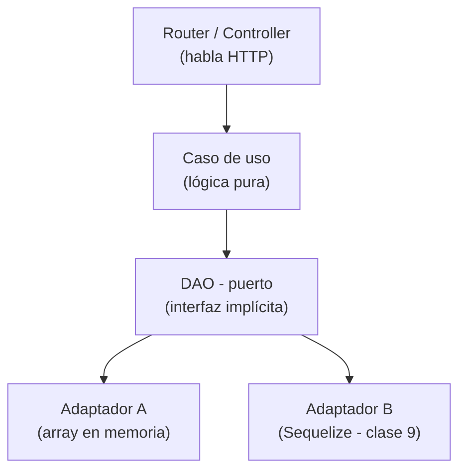

# Clase 7 — Arquitectura en capas: casos de uso, DAO como puerto e inversión de dependencias

## Objetivos de la clase

- Entender **por qué** la lógica de negocio no debe vivir en los controllers.
- Conocer el patrón de **capas**: router/controller → casos de uso → DAO/repository.
- Comprender qué es un **puerto** (interfaz implícita en JS) y un **adaptador**.
- Aprender a hacer **inversión de dependencias manual** pasando el DAO como argumento.
- Extraer los primeros casos de uso del controller y dejar el controller como un delegador puro.

---

## 1. Dónde estamos y cuál es el problema

Al final de la clase 6 nuestro proyecto tiene esta forma:

```
biblioteca-api-express/
├── index.js
├── package.json
├── errors/AppError.js
├── schemas/bookSchema.js
├── routes/
│   ├── index.js           ← router central
│   └── booksRoutes.js
├── controllers/
│   └── booksController.js
└── middlewares/
    ├── logger.js
    ├── validate.js
    ├── notFound.js
    └── errorHandler.js
```

El controller hace **demasiado**. Mirá `create`:

```js
// controllers/booksController.js — situación actual
function create(req, res, next) {
  const { titulo, autor, isbn, stock } = req.body; // ← ya validado por Zod

  // ¿El ISBN ya existe? Regla de negocio
  if (isbn && books.find((b) => b.isbn === isbn)) {
    return next(new AppError("ISBN_DUPLICATE", "Ese ISBN ya está registrado", 409));
  }

  // Armar el libro. Regla de negocio
  const newBook = { id: books.length + 1, titulo, autor, isbn, stock };

  // Persistir. Responsabilidad de infraestructura
  books.push(newBook);

  res.status(201).json(newBook);
}
```

En 10 líneas el controller hace tres cosas distintas:

1. **Regla de negocio** — "no puede haber dos libros con el mismo ISBN".
2. **Creación del objeto** — "así se arma un libro".
3. **Persistencia** — `books.push(newBook)` accede directamente al array en memoria.

### ¿Por qué es un problema?

**No podemos testear la regla de negocio sin HTTP.** Si queremos verificar que el ISBN duplicado devuelve 409, tenemos que levantar Express, hacer un POST… o hacer malabarismos con mocks. El controller está entrelazado con la capa HTTP (`req`, `res`, `next`) y con la persistencia (`books` importado directamente).

**No podemos cambiar la persistencia sin tocar el controller.** Si mañana queremos guardar libros en Sequelize (clase 9), hay que reescribir el controller.

**La lógica queda duplicada si hay otro punto de entrada.** Si aparece una CLI o un worker que también necesita crear libros, ¿copiamos el `if isbn duplicate`?

---

## 2. La solución: separar en capas

La idea es sencilla: **cada capa tiene una sola responsabilidad** y solo habla con la que tiene inmediatamente debajo.

```
┌──────────────────────────────────┐
│   Router / Controller (HTTP)     │  ← habla HTTP: req, res, next
├──────────────────────────────────┤
│          Casos de uso            │  ← lógica de negocio pura (sin HTTP, sin BD)
├──────────────────────────────────┤
│     DAO / Repository (puerto)    │  ← interfaz: getAll, getById, save, update, delete
├──────────────────────────────────┤
│    Adaptador de persistencia     │  ← implementación concreta: array, archivo, Sequelize
└──────────────────────────────────┘
```



*(si tu editor no renderiza Mermaid, instalá la extensión "Markdown Preview Mermaid Support" en VSCode)*

### Responsabilidades de cada capa

| Capa         | Sabe de                                       | No sabe de                                    |
| ------------ | --------------------------------------------- | --------------------------------------------- |
| Controller   | HTTP (`req`, `res`, `next`)             | Cómo se guardan los datos, reglas de negocio |
| Caso de uso  | Reglas de negocio                             | HTTP, base de datos concreta                  |
| DAO / puerto | Qué operaciones de datos necesita el negocio | Cómo se implementan (array, SQL, etc.)       |
| Adaptador    | Cómo persistir (array, archivo, SQL)         | Negocio, HTTP                                 |

---

## 3. El caso de uso

Un **caso de uso** es una función (o clase) que implementa **una acción del negocio**. No recibe `req`, no toca `res`, no sabe que existe HTTP. Solo recibe datos primitivos y devuelve datos primitivos (o tira un `AppError`).

```js
// usecases/createBook.js
import AppError from "../errors/AppError.js";

async function createBook({ titulo, autor, isbn, stock }, dao) {
  // Regla de negocio: ISBN único
  if (isbn) {
    const existing = await dao.getByIsbn(isbn);
    if (existing) {
      throw new AppError("ISBN_DUPLICATE", "Ese ISBN ya está registrado", 409);
    }
  }

  // Armamos el objeto libro
  const newBook = { titulo, autor, isbn, stock: stock ?? 0 };

  // Delegamos el guardado al DAO — no sabe cómo lo hace
  return dao.save(newBook);
}

export default createBook;
```

Cosas importantes:

- **Sin `req`, sin `res`**: la firma es `(datos, dao)`, no `(req, res, next)`.
- **Tira `AppError`**: si algo está mal, lanza. El controller lo atrapa y llama `next(err)`.
- **Delega al DAO**: llama a `dao.save(newBook)`, sin importar si `save` hace un `array.push` o un `INSERT INTO`.

### Qué queda en el controller

Con el caso de uso extraído, el controller se convierte en un **delegador HTTP puro**:

```js
// controllers/booksController.js
import createBook from "../usecases/createBook.js";

async function create(req, res) {
  const book = await createBook(req.body, dao);
  res.status(201).json(book);
}
```

El controller ahora hace exactamente dos cosas: extraer datos de `req` y formar la `res`. **Nada más.**

---

## 4. El DAO como "puerto"

**DAO** son las siglas de *Data Access Object*. En nuestra arquitectura, el DAO es un **contrato** (implícito en JS) que describe qué operaciones de datos necesita el negocio:

```
dao.getAll()              → Promise<book[]>
dao.getById(id)           → Promise<book | null>
dao.getByIsbn(isbn)       → Promise<book | null>
dao.save(book)            → Promise<book>      ← devuelve el libro con el id asignado
dao.update(id, changes)   → Promise<book | null>
dao.delete(id)            → Promise<boolean>
```

En lenguajes con interfaces (TypeScript, Java), esto sería una `interface`. En JavaScript puro es un acuerdo: "cualquier objeto que tenga estos métodos funciona como DAO".

### El adaptador en memoria (hoy)

La implementación concreta para hoy usa un array:

```js
// dao/booksMemoryDao.js
let books = [
  { id: 1, titulo: "El principito", autor: "Saint-Exupéry", isbn: null, stock: 3 },
];
let nextId = 2;

const booksMemoryDao = {
  async getAll() {
    return [...books]; // copia defensiva
  },

  async getById(id) {
    return books.find((b) => b.id === id) ?? null;
  },

  async getByIsbn(isbn) {
    return books.find((b) => b.isbn === isbn) ?? null;
  },

  async save(data) {
    const newBook = { id: nextId++, ...data };
    books.push(newBook);
    return newBook;
  },

  async update(id, changes) {
    const idx = books.findIndex((b) => b.id === id);
    if (idx === -1) return null;
    books[idx] = { ...books[idx], ...changes };
    return books[idx];
  },

  async delete(id) {
    const idx = books.findIndex((b) => b.id === id);
    if (idx === -1) return false;
    books.splice(idx, 1);
    return true;
  },
};

export default booksMemoryDao;
```

Todos los métodos son `async` aunque hoy trabajen con un array sincrónico. Así, cuando en la clase 9 cambiemos al adaptador Sequelize (que sí es async), **el contrato no cambia** y los casos de uso no se enteran.

---

## 5. Inversión de dependencias manual

Acá está el corazón del patrón. La pregunta es: ¿cómo le llega el DAO al caso de uso?

### Concepto y la analogía del tomacorriente

Para comprender la Inversión de Dependencias (DIP, el principio SOLID), se puede utilizar la analogía de un tomacorriente doméstico:

- **Sin Inversión de Dependencias (Acoplado):** Sería como si un electrodoméstico tuviese sus cables internos soldados directamente a los cables de la pared. Si la compañía eléctrica cambia la tecnología o se quiere mover el artefacto, habría que romper la pared y desoldar los cables.
- **Con Inversión de Dependencias (Desacoplado):** Se introduce un contrato intermedio (el tomacorriente). La pared ofrece un enchufe estándar y el artefacto posee una ficha estándar. Al artefacto no le importa si la energía proviene de una fuente solar, hidroeléctrica o un generador; solo requiere un tomacorriente compatible para funcionar.

En el código de la aplicación, el "tomacorriente" es el contrato del DAO (sus métodos como `getByIsbn` y `save`).

### Inversión de Dependencias (DIP) vs Inyección de Dependencias (DI)

- **Inversión de Dependencias (DIP):** Es el principio de diseño (SOLID). Establece que la lógica de negocio no debe depender de una base de datos específica, sino de una abstracción o contrato.
- **Inyección de Dependencias (DI):** Es la técnica práctica mediante la cual se pasa la dependencia desde afuera (por parámetros de función o constructor).
- **Manual:** Se denomina "manual" porque en Node.js puro la dependencia se pasa explícitamente sin utilizar un framework con contenedor IoC automático (como NestJS o Spring).

### Opción A — Importar directo (Acoplado)

```js
// usecases/books/createBook.js
import dao from "../../dao/booksMemoryDao.js"; // Acoplado a la implementación concreta

async function createBook(data) {
  // ...
  return dao.save(data);
}
```

Si queremos cambiar a Sequelize o reemplazar la base de datos, habría que editar el caso de uso. Y para testear, habría que mockear módulos. Esto es exactamente lo que queremos evitar.

### Opción B — Inyectar como argumento (Desacoplado)

```js
// usecases/books/createBook.js
async function createBook(data, dao) { // dao viene de afuera
  // ...
  return dao.save(data);
}
```

Ahora `createBook` no importa nada de la capa de persistencia. Quien llame a `createBook` decide qué DAO utilizar. Eso es **inversión de dependencias**: la función de alto nivel (caso de uso) no depende de la implementación de bajo nivel (array, SQL); ambas dependen del contrato (el objeto `dao` con sus métodos).

### Beneficios principales

1. **Flexibilidad:** Si se cambia la persistencia a PostgreSQL en el futuro, el caso de uso no sufre modificaciones.
2. **Testeabilidad:** En un test unitario no se requiere una base de datos real; se puede enviar un objeto simulado (mock) con los mismos métodos.
3. **Mantenibilidad:** La lógica de negocio queda aislada de la infraestructura.

### Opción C — Factory que arma el caso de uso (clase 8)

En la clase 8 se analiza cómo crear una *factory* que recibe el DAO y devuelve todos los casos de uso ya configurados, para no tener que pasar el `dao` manualmente en cada llamada. Por ahora, la opción B es suficiente para entender el concepto.

---

## 6. La nueva estructura del proyecto

```
biblioteca-api-express/
├── index.js
├── package.json
├── errors/AppError.js
├── schemas/bookSchema.js
├── dao/
│   └── booksMemoryDao.js       ← [NUEVO] adaptador en memoria
├── usecases/
│   ├── getBooks.js             ← [NUEVO]
│   ├── getBookById.js          ← [NUEVO]
│   ├── createBook.js           ← [NUEVO]
│   ├── updateBook.js           ← [NUEVO]
│   └── deleteBook.js           ← [NUEVO]
├── routes/
│   ├── index.js                ← router central (sin cambios)
│   └── booksRoutes.js          ← sin cambios
├── controllers/
│   └── booksController.js      ← [MODIFICADO] — solo delega
└── middlewares/
    ├── logger.js
    ├── validate.js
    ├── notFound.js
    └── errorHandler.js
```

> Notá que `data/books.js` desaparece — la semilla pasa a vivir dentro de `booksMemoryDao.js`.

---

## 7. El controller después del refactor

Una vez que los casos de uso están extraídos, el controller queda así de delgado:

```js
// controllers/booksController.js
import AppError from "../errors/AppError.js";
import dao from "../dao/booksMemoryDao.js";

import getBooks    from "../usecases/getBooks.js";
import getBookById from "../usecases/getBookById.js";
import createBook  from "../usecases/createBook.js";
import updateBook  from "../usecases/updateBook.js";
import deleteBook  from "../usecases/deleteBook.js";

async function list(req, res) {
  const books = await getBooks(dao);
  res.json(books);
}

async function get(req, res) {
  const book = await getBookById(Number(req.params.id), dao);
  if (!book) throw new AppError("BOOK_NOT_FOUND", "No existe un libro con ese id", 404);
  res.json(book);
}

async function create(req, res) {
  const book = await createBook(req.body, dao);
  res.status(201).json(book);
}

async function update(req, res) {
  const book = await updateBook(Number(req.params.id), req.body, dao);
  if (!book) throw new AppError("BOOK_NOT_FOUND", "No existe un libro con ese id", 404);
  res.json(book);
}

async function remove(req, res) {
  const ok = await deleteBook(Number(req.params.id), dao);
  if (!ok) throw new AppError("BOOK_NOT_FOUND", "No existe un libro con ese id", 404);
  res.status(204).send();
}

export default { list, get, create, update, remove };
```

Fijate: el controller importa `dao` directamente por ahora (la factory vendrá en clase 8), pero la lógica de negocio ya no vive acá.

---

## 8. Por qué `async` en los métodos del DAO aunque use un array

Es tentador escribir los métodos del DAO sin `async`:

```js
// ❌ tentación
getAll() {
  return books;
},
```

Pero si lo hacemos así, cuando en clase 9 cambiemos a Sequelize:

```js
// ✅ Sequelize siempre es async
async getAll() {
  return Book.findAll();
},
```

...los casos de uso que antes hacían `dao.getAll()` (sin `await`) van a fallar silenciosamente — van a recibir una `Promise` en lugar de los datos. Al definir los métodos como `async` desde el principio, **forzamos a los casos de uso a usar `await`**, y el cambio de adaptador no rompe nada.

---

## 9. Beneficios concretos de esta separación

### Testeabilidad sin infra

```js
// test unitario de createBook — sin Express, sin array real
import createBook from "../usecases/createBook.js";

test("lanza error si el ISBN ya existe", async () => {
  const fakeDao = {
    getByIsbn: async () => ({ id: 1, isbn: "1234567890123" }), // simula que ya existe
    save: async () => {},
  };

  await expect(createBook({ isbn: "1234567890123" }, fakeDao))
    .rejects.toMatchObject({ code: "ISBN_DUPLICATE" });
});
```

No necesitamos Express, no necesitamos un array real, no necesitamos HTTP. Solo el caso de uso y un objeto falso con el contrato del DAO. Esto es lo que veremos en profundidad en la clase 14.

### Cambiabilidad de persistencia

En clase 9, para cambiar de array a Sequelize, solo tocamos el adaptador. Los casos de uso, el controller y las rutas quedan **exactamente igual**.

### Legibilidad del negocio

La carpeta `usecases/` es el glosario del negocio. Si alguien nuevo entra al proyecto, lee `createBook.js`, `updateBook.js`, etc., y entiende qué hace el sistema **sin necesidad de entender Express ni la base de datos**.

---

## 10. Aclaraciones frecuentes

### ¿"Servicio" y "caso de uso" son lo mismo?

Sí. Es solo una diferencia de vocabulario según el framework o la arquitectura de referencia:

| Nombre                        | Dónde se usa                                    |
| ----------------------------- | ------------------------------------------------ |
| **Service**             | NestJS, Spring, arquitecturas clásicas en capas |
| **Use case**            | Clean Architecture (Uncle Bob)                   |
| **Interactor**          | Otra variante de Clean Architecture              |
| **Application service** | Domain-Driven Design (DDD)                       |

Todos describen **la misma capa**: lógica de negocio pura, sin HTTP, sin base de datos. En este curso usamos "caso de uso" porque hace más explícito qué hace cada archivo — `createBook.js` es literalmente "el caso de uso de crear un libro".

Con "service" es común terminar con un `BookService` que tiene 10 métodos adentro, lo que con el tiempo se convierte en otro lugar donde se acumula todo. Con un archivo por caso de uso, cada responsabilidad es más fácil de testear y de encontrar.

En una entrevista, decir "servicio" o "caso de uso" es correcto en ambos casos — son sinónimos en la práctica.

---

### ¿Dónde va el `try/catch`?

Esta es una de las confusiones más comunes al aprender arquitectura en capas.

| Capa                                  | `try/catch` | Por qué                                                                                           |
| ------------------------------------- | ------------- | -------------------------------------------------------------------------------------------------- |
| Controller                            | ❌            | Express 5 atrapa los errores de handlers`async` automáticamente y los manda al `errorHandler` |
| Caso de uso                           | ❌            | Solo tira`AppError` para errores esperados; los bugs suben solos hasta el `errorHandler`       |
| DAO en memoria                        | ❌            | Un array nunca falla                                                                               |
| DAO con Sequelize / archivo (clase 9) | ✅            | Traduce errores de infraestructura →`AppError`                                                  |

El `try/catch` vive en el **adaptador**, no en el negocio. La razón es que el DAO en Sequelize puede tirar errores propios de la base de datos — errores que el caso de uso no debería conocer. El adaptador los atrapa y los convierte en `AppError` antes de que suban:

```js
// dao/booksSqlDao.js — clase 9
async save(data) {
  try {
    const book = await Book.create(data);
    return book.toJSON();
  } catch (err) {
    // Sequelize tira este error si el ISBN ya existe en la BD
    if (err.name === "SequelizeUniqueConstraintError") {
      throw new AppError("ISBN_DUPLICATE", "Ese ISBN ya está registrado", 409);
    }
    throw err; // cualquier otro error de BD sube como error inesperado → 500
  }
}
```

De esta forma, el caso de uso `createBook.js` nunca ve un error críptico de Sequelize — solo ve `AppError`. La regla: **cada capa habla el idioma de su capa, no del de abajo**.

> **En clase 5** el `try/catch` estaba en el controller porque todavía no existía el `errorHandler` central. A partir de clase 6, con el `errorHandler` en su lugar, el controller no necesita atrapar nada.

---

## Cierre

Hoy hicimos el primer paso de la arquitectura en capas: sacamos la lógica de negocio de los controllers hacia *casos de uso* independientes, y creamos el DAO en memoria como primer adaptador de persistencia. El controller quedó como un traductor HTTP puro.

En la clase 8 profundizamos: DAO/Repository pattern + *factories* que arman los casos de uso con el DAO ya inyectado, para no tener que pasarlo en cada llamada.